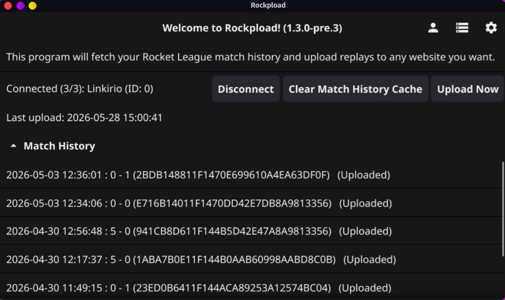
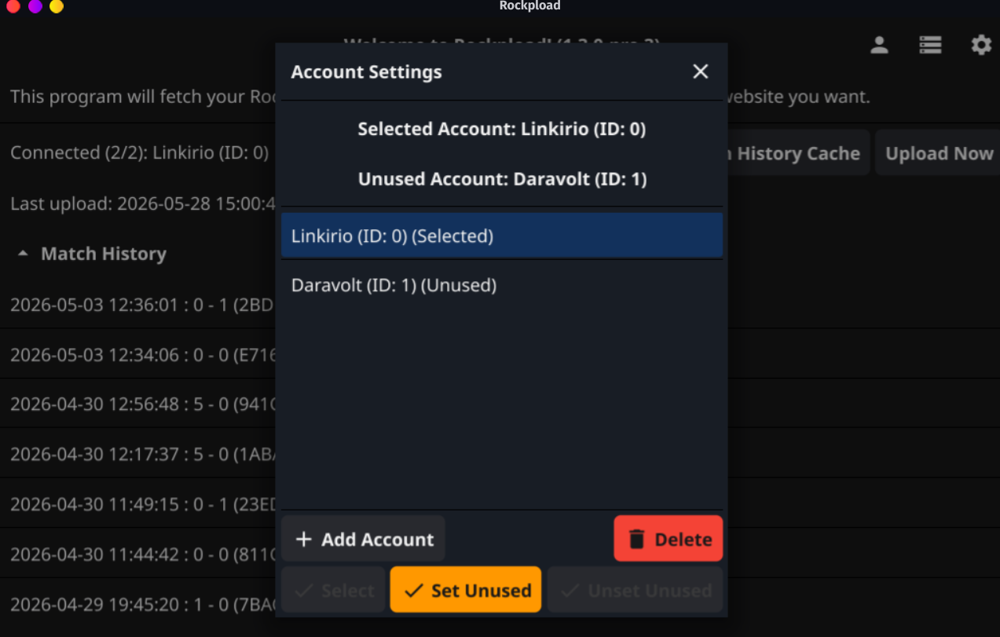
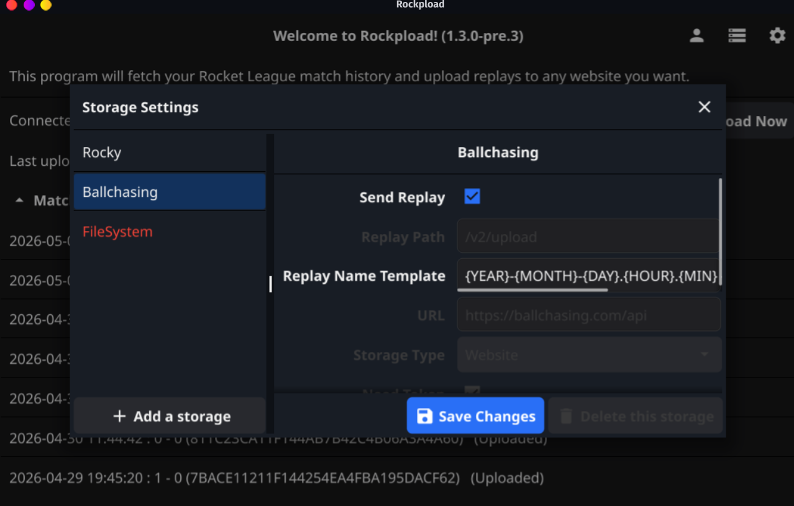

# Rockpload

[](LICENSE)
[](https://go.dev/)
[](https://discord.gg/bFw6mcVXSW)

<p align="center">
   
</p>


A desktop companion app for Rocket League that watches your replay history and automatically uploads new replays to any website!

## Features

- **Automatic Upload**: Monitors your Rocket League game and uploads new replays in real time
- **Epic Games Authentication**: Seamless authentication via Epic Games Launcher or custom OAuth
- **Multi Account Upload**: Allow to upload for multiple account at the same time
- **Multi Website Upload**: Allow to upload for multiple website at the same time ([Rocky](https://lexore.ca/rocky), [Ballchasing](https://ballchasing.com) and [BLAST.tv](https://blast.tv) are preconfigured, but you can add as many as you want)
- **System Tray Integration**: Runs quietly in the background with system tray controls
- **Auto-start Support**: Launch rockpload automatically on system startup
- **Cross-platform**: Supports Linux, Windows, and Android (macOS is not supported yet)
- **Console Platform**: Supports Epic Games Store, Steam, and console (PlayStation, XBox, Nintendo) as long as the program run on a PC

## Supported Platforms

- **Linux** (amd64)
- **Windows** (amd64)
- **Android** (APK)
- **macOS**: Not supported yet


## Screenshots








## Installation

### Download Pre-built Binary

Download the latest release from the [GitHub Releases](https://github.com/LEX0RE/rockpload/releases) page.

### Build from Source

**Prerequisites:**
- Go 1.26.1 or later
- CGO toolchain (GCC on Linux, MinGW on Windows for cross-compilation)

**Build:**
```bash
scripts/build.sh
```

The build script will produce binaries for Linux and Windows in `releases/`.
It uses the version from `VERSION` by default, or `ROCKPLOAD_VERSION` when set.

To build the Android APK, install the Fyne CLI and the Android SDK/NDK, then run:

```bash
go install fyne.io/tools/cmd/fyne@latest
scripts/build-android.sh
```

The Android APK is written to `releases/`. You can also include it in the standard release build:

```bash
BUILD_ANDROID=true scripts/build.sh
```

The mobile build keeps account management, authentication, replay history, manual uploads, and website/storage settings. Desktop-only integrations are disabled on mobile: system tray, autostart, Rocket League process/log watching, upload-on-RL-close, and local StatsAPI live stats.

### Update the Project Version

Use the helper script to update the release version shared by Go builds and Nix:

```bash
scripts/set-version.sh 1.3.0
scripts/set-version.sh 1.3.0-rc.1
scripts/set-version.sh --check
```

The script accepts an optional leading `v`, but stores the canonical version without it.
Release tags should keep the `v` prefix:

```bash
git tag "$(scripts/set-version.sh --print-tag)"
```

### Build with Nix

This repository also provides a Nix flake for Linux builds and development shells:

To run the latest stable GitHub release, excluding pre-releases:

```bash
nix run github:LEX0RE/rockpload/stable
```

To install the latest stable GitHub release into your Nix profile:

```bash
nix profile install github:LEX0RE/rockpload/stable
```

To try the latest pre-release or beta build:

```bash
nix run github:LEX0RE/rockpload/prerelease
```

For local development from a checkout:

```bash
nix develop
nix build
```

The default package builds the Rockpload Linux binary, and the default app runs it:

```bash
nix run
```

If you use direnv, allow the checked-in `.envrc` once to enter the same development shell automatically:

```bash
direnv allow
```

### NixOS and Home Manager Modules

The flake exposes both NixOS and Home Manager modules:

```nix
{
  inputs.rockpload.url = "github:LEX0RE/rockpload";

  outputs = { nixpkgs, rockpload, ... }: {
    nixosConfigurations.example = nixpkgs.lib.nixosSystem {
      modules = [
        rockpload.nixosModules.default
        {
          services.rockpload.enable = true;
        }
      ];
    };
  };
}
```

For Home Manager:

```nix
{
  imports = [
    inputs.rockpload.homeManagerModules.default
  ];

  services.rockpload.enable = true;
}
```

Both modules install the package and create a user service tied to `graphical-session.target`.

## Usage

Run the application:
```bash
./rockpload  # Linux
rockpload.exe  # Windows
```

Setup:
1. Start the program on the PC
2. Connect to your Epic account (if you are on another console/store then Epic, be sure that your account is linked to Epic)
3. All the settings will be up right (Account Management, Storage Management and App Settings). Its there that you activate the auto upload
4. If you wanna upload to Ballchasing, go to Storage Management and be sure that the Token is there and that the "Send Replay" is checked
5. For not being disconnect while playing the game, be sure to have an account in the "Unused Account" section. This account is used to check for Online Status of all others account you have before trying to upload

**Local State:**
- Config: `~/.cache/rockpload/` (Linux) or `%LOCALAPPDATA%\rockpload\` (Windows)
- Cache: `~/.cache/rockpload/`

**Logs file:**
- Linux: `/home/.cache/rockpload/rockpload.log`
- Windows: `C:\Users\<Username>\AppData\Local\rockpload\rockpload.log` (Replace `<Username>` with your Windows username) 

**Note:** If you run the program on multiple devices, each device will need to authenticate separately. Only one device per account can maintain a valid token at a time.

## Contributing

Contributions are welcome! Please see [CONTRIBUTING.md](CONTRIBUTING.md) for guidelines on:
- Setting up your development environment
- Code style and formatting requirements
- Pull request workflow

## License

This project is licensed under the Apache License 2.0 - see the [LICENSE](LICENSE) file for details.

Copyright 2026 LEX0RE
